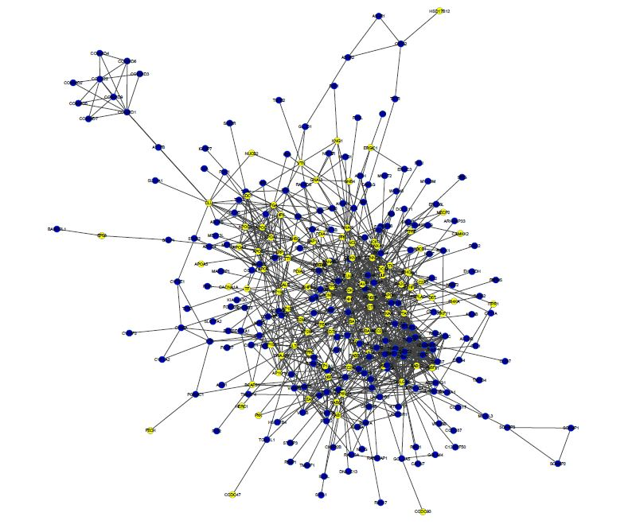

```{r style, echo = FALSE, results = 'asis', warning=FALSE, message=FALSE}
library(knitr)
library(subnetsim)
```

<br />

**Package**: `r packageDescription("subnetsim")[["Package"]]` <br />
**Authors**: `r packageDescription("subnetsim")[["Author"]]` <br />
**Version**: `r packageDescription("subnetsim")$Version` <br />
**Compiled date**: `r Sys.Date()` <br />
**License**: `r packageDescription("subnetsim")[["License"]]` <br />


# Licensing 

The *`r packageDescription("subnetsim")[["Package"]]`* package and the underlying 
*`r packageDescription("subnetsim")[["Package"]]`* code 
are distributed under the Artistic license 2.0. You are free to use and 
redistribute this software.


# Citing

If you use the *`r packageDescription("subnetsim")[["Package"]]`* package for a publication, we would ask you to cite the
following:

> Martial Boutchueng-Djidjou, Pascal Belleau, Nicolas Bilodeau, Suzanne Fortier, Sylvie Bourassa, Arnaud Droit, Sabine Elowe, Robert L. Faure. 2018. A type 2 diabetes disease module with a high collective influence for Cdk2 and PTPLAD1 is localized in endosomes. bioRxiv <a href="http://dx.doi.org/10.1101/341693">doi:10.1101/341693</a>


# Introduction

Network science is a cross-disciplinary domain that focuses on the representation, analysis and modeling of complex systems as networks or graphs. Networks are commonly used to study complex systems in many disciplines such as social science, computer science and life sciences [@Bader].

A network model is a mathematical model that is designed to represent entities and their relationships in a system. A network is a collection of nodes (or vertices or sites or actors) joined by edges (or links or bonds or ties). Through the help of modern computers, the structure of complex and quite large networks can now be more easily generated, visualized and analyzed. Even more, as networks are logically equivalent to graphs, knowledge that can be represented as a set of entities with interactions can be represented as a network.

In computational biology, Cytoscape [@Shannon2003] is a very popular open source software platform for network modeling and visualization. Even though Cytoscape was originally designed for biological research, it is a general platform. In biology, Cytoscape can be used to identify disease modules which are defined as connected subnetworks showing mechanistic evidence for a specific phenotype. 

In the context of new subnetwork identification, it is of interest to have access to measures of connectivity that could validate that the probability that this subnetwork could arise by chance are not significant.

The *`r packageDescription("subnetsim")[["Package"]]`* package uses bootstrapping to test the hypothesis that a specific 
subnetwork is more connected than randomly generated subnetworks with the same number of nodes. 
Three measures of connectivity are validated: 

* the number of nodes in the subnetwork including all the first-degree neighbor nodes
* the number of links in the subnetwork including all the links of the first-degree neighbor nodes
* the number of links in the subnetwork

    
# Description of the sampling of the subnetworks

The simulated subnetworks are generated by bootstrapping from a global network. 
The global network must correspond to the network that the tested subnetwork comes from.
Each simulated sunbetwork contains the exact same number of nodes as the real subnetwork. 

    
# SIF Format Input

The Simple interaction file (SIF) format is one of multiple formats that Cytoscape can read. For the moment, it is the
only format used by the *`r packageDescription("subnetsim")[["Package"]]`* package.

The SIF format only specifies nodes and interactions. This format has the advantage to be easy to 
create in a text editor or spreadsheet. The file should not have any header line.

```{r relationSIF}
# Example of a SIF file content

# nodeA <relationship type> nodeB
# nodeC <relationship type> nodeA
# nodeD <relationship type> nodeE nodeF nodeB
```

Duplicate entries are ignored and multiple edges between the same nodes are permitted as 
long as the relationship types are different.

Some common relationship types, used in the Systems Biology community, are: 

*  pp  : protein – protein interaction
*  pd  : protein -> DNA 

```{r SIFdemo, message=FALSE, warning=FALSE, collapse=TRUE}
# Access SIF demo file stored in the subnetsim package
networkFile <- system.file("extdata", "demo_network.sif", package="subnetsim")

# Read SIF file
sifData <- read.table(networkFile, header=FALSE)

# First line of the SIF file
head(sifData)
```


# An analysis step by step

For this analysis, a gene-gene interaction network containing a subnetwork of interest will be used. The Figure 1 shows both the network and its subnetwork.



## 1. Loading subnetsim package

As with any R package, the *`r packageDescription("subnetsim")[["Package"]]`* package should 
first be loaded with the following command:

```{r loadingPackage, warning=FALSE, message=FALSE}
library(subnetsim)
```


## 2. Loading the global network and the tested subnetwork

The global network must be in a SIF format file. The *network()* function 
must be used to load the network. The tested subnetwork, when available in 
SIF format file, can be passed to the *network()* function to be loaded as a 
subsection of the global network.

```{r loadNetwork, warning=FALSE, message=FALSE, collapse=TRUE, cache=TRUE}
# Access demo files stored in the subnetsim package
networkFile <- system.file("extdata", "demo_network.sif", package="subnetsim")
subnetworkFile <- system.file("extdata", "demo_subnetwork.sif", package="subnetsim")

# Load a global network and its tested subnetwork using 
# SIF format files
demo_network_with_sub <- network(netFileName = networkFile,
                                 subNetFileName = subnetworkFile)

# The returned object is an object of class "network"
class(demo_network_with_sub)

# The network object contains the information from the global network
# 1- All the links between each node in a hash format
summary(demo_network_with_sub$netAll)
# 2- All the names of the nodes
head(demo_network_with_sub$nodesAll)
```


## 3. Generating the simulated subnetworks

A fixed number of simulated subnetworks are generated through the *simuleSubNet()* function.
Bootstrapping is used to generate subnetworks that have the exact same number of nodes as
the tested subnetwork. 

Beware that the function can take some time to process when the number of iterations is large.

The proportion of the simulated subnetworks that have higher measures of connectivity than the tested 
subnetwork is accessible from the object generated by the *simuleSubNet()* function. Those proportions
are used to assess the probability that the tested subnetwork could arise by chance.

```{r simSubNet, warning=FALSE, message=FALSE, collapse=TRUE, cache=TRUE}
simulatedSubnetwork <- subnetwork(network = demo_network_with_sub, nbIter = 30, seedV = 111111)

# The returned object is an object of class "subnetwork"
class(simulatedSubnetwork)

# The content of the "subnetwork" is easily accessible
simulatedSubnetwork
```

## 4. Extract information from the simulated subnetworks

The *subnetwork()* function returns an object of class *"subnetwork"* that contains the information relative to the simulation.

```{r simSubNetValues, warning=FALSE, message=FALSE, collapse=TRUE, cache=TRUE}
#####################################################
# First, the list of the parameters values
#####################################################

# The number of simulation
simulatedSubnetwork$nbIter 

# The value of the seed for the simulation.
simulatedSubnetwork$seed

# The number of nodes of the subnetwork which corresponded to the number of all the subnetwork simulated.
simulatedSubnetwork$nbNodes

# The number of links in the subnetwork observed
simulatedSubnetwork$nbLinkTested

# The number of nodes in the subnetwork observed including all the first-degree neighbor nodes.
simulatedSubnetwork$nbNodesOneLinkTested

# The number of links in the subnetwork observed including all the links of the first-degree neighbor nodes.
simulatedSubnetwork$nbLinkOneLinkTested

#####################################################
# Second, the results from the simulated subnetworks 
#####################################################

# A vector of the number of links in each subnetwork simulated.
simulatedSubnetwork$nbLink

# A vector of the number of nodes in each subnetwork simulated including all the first-degree neighbor nodes.
simulatedSubnetwork$nbNodesOneLink

# A vector of the number of links in each subnetwork simulated including all the links of the first-degree neighbor nodes.
simulatedSubnetwork$nbLinkOneLink

```

## 5. Plot the results

A graph showing the position of the observed values compared to the simulated results can be easily 
generated using the *plot()* function.

```{r graphRes, warning=FALSE, message=FALSE, collapse=TRUE, cache=TRUE, fig.align="center", fig.cap="Distribution of the simulated measures of connectivity versus the observed values."}
# Generate a graph for the three measures of connectivity
plot(simulatedSubnetwork)
```


# Session info

Here is the output of sessionInfo() on the system on which this document 
was compiled:

```{r sessionInfo, echo=FALSE}
sessionInfo()
```


# References

